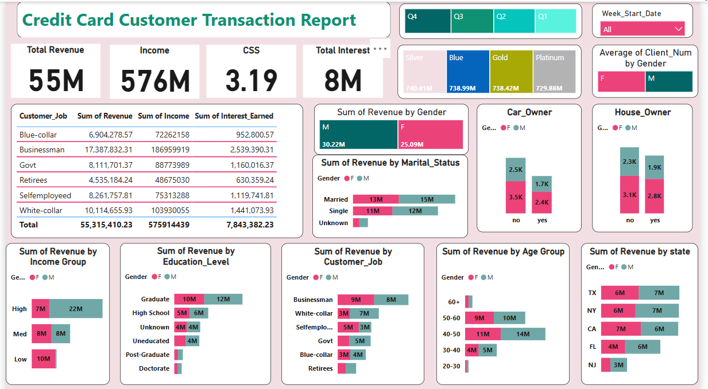

# 💳 Credit Card Customer & Transaction Report  

An **interactive Power BI dashboard** analyzing customer behavior, credit card transactions, and spending patterns.  
This project highlights how **data-driven insights** can help financial institutions improve decision-making, customer segmentation, and product strategy.  

---

## 📊 Dashboard Overview  

### 🔹 Dashboard 1 – Customer Transaction Report  
- **KPIs:** Total Revenue (55M), Income (576M), CSS (3.19), Total Interest (8M)  
- **Customer Demographics:** Revenue by Gender, Age Group, Marital Status, Education Level, Income Group  
- **Job Insights:** Revenue, Income & Interest Earned by Job Categories (Businessman, Govt, Self-employed, etc.)  
- **Ownership Trends:** Car Owner vs. Non-Car Owner, House Owner vs. Non-House Owner  
- **Geographic Analysis:** Revenue by State (TX, NY, CA, FL, NJ)  

### 🔹 Dashboard 2 – Transaction Report  
- **KPIs:** Total Revenue (55M), Total Transactions (45M), Transaction Volume (656K), Total Interest (8M)  
- **Card Performance:** Revenue & Interest by Card Type (Silver, Blue, Gold, Platinum)  
- **Transaction Methods:** Swipe, Chip, Online  
- **Spending Categories:** Bills, Entertainment, Fuel, Grocery, Food, Travel  
- **Quarterly Trends:** Revenue & Transaction Volume across Q1–Q4  

---

## 🚀 Features  
✔️ Interactive filters by **Quarter & Week**  
✔️ Visual insights across **demographics, spending habits, and regions**  
✔️ Breakdown by **Card Type & Customer Profile**  
✔️ Comparison of **transaction methods** and **expense categories**  
✔️ **Dynamic charts & KPIs** for easy decision-making  

---

## 🛠️ Tools & Technologies  
- **Power BI** → Dashboard creation & DAX measures  
- **SQL & Excel** → Data cleaning, preparation, and integration  
- **Data Analysis** → Trend analysis, segmentation, business insights  

---

## 📌 Use Cases  
- Understand **customer spending patterns**  
- Identify **high-revenue customer groups**  
- Track **card performance** (Blue, Gold, Platinum, Silver)  
- Support **strategic decision-making** for banks & financial services  

---

## 📷 Screenshots  

### Credit Card Customer Transaction Report  
  

### Credit Card Transaction Report  
  

---

## 📂 Project Structure  
```bash
├── data/                # Raw & processed datasets (not uploaded due to confidentiality)  
├── dashboard/           # Power BI dashboard files (.pbix)  
├── images/              # Dashboard screenshots  
├── README.md            # Project documentation  
